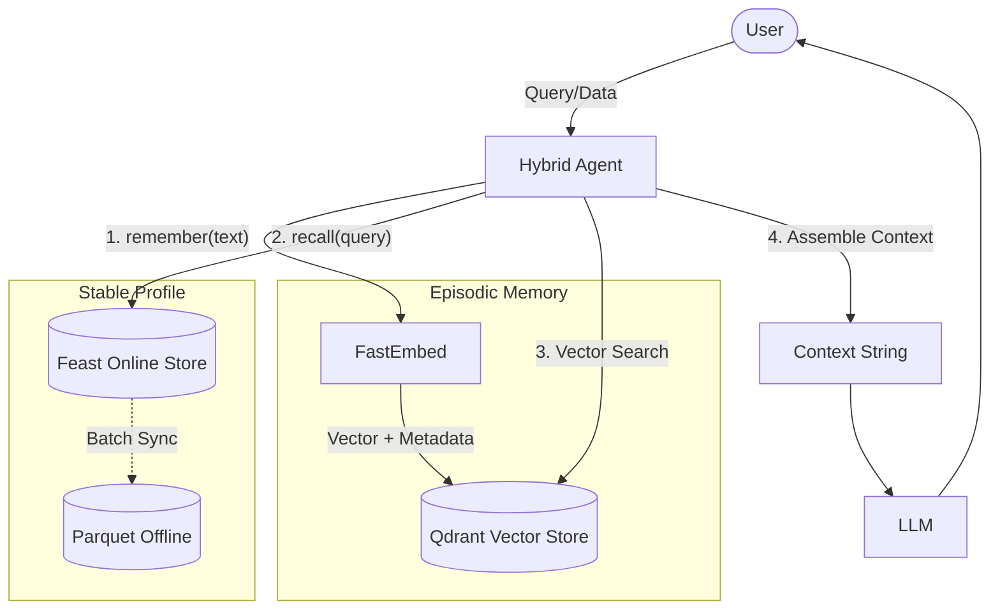

# Hybrid Memory Architecture (POC)

Tài liệu thiết kế kiến trúc Hybrid Memory tích hợp **Episodic Memory (Vector Store)** và **Stable Profile (Feature Store)**.

## 1. Sơ đồ Kiến trúc

## 2. Quyết định Kiến trúc & Trade-offs

### 2.1. Chiến lược Chunking (Episodic Memory)
* **Lựa chọn:** Semantic chunking theo ngữ cảnh hội thoại thay vì token-based chunking cố định.
* **Trade-off:** Đánh đổi chi phí tính toán cao hơn ở pha ingestion để tăng recall quality. Tránh tình trạng cắt đứt ngữ cảnh quan trọng, đặc biệt hiệu quả đối với dữ liệu hội thoại phân mảnh.

### 2.2. Feature Schema (Stable Profile)
* **Lựa chọn:** Lưu profile dài hạn dưới dạng Tabular Features rõ ràng (VD: `topic_affinity`, `reading_speed_wpm`).
* **Trade-off:** Chấp nhận giảm khả năng biểu diễn sắc thái phức tạp so với latent embedding features để tối đa hóa tính diễn giải (interpretability). Hỗ trợ kiểm soát, điều chỉnh schema linh hoạt và dễ dàng tiêm (inject) vào LLM prompt.

### 2.3. Chiến lược Freshness
* **Lựa chọn:** Batch update (5 phút/lần) cho Stable Profile và Real-time cho Episodic Memory.
* **Trade-off:** Tối ưu chi phí hạ tầng. Stable Profile ít thay đổi đột ngột nên không cần streaming đắt đỏ, trong khi Episodic Memory yêu cầu độ trễ thấp để duy trì UX.

## 3. Quyết định Loại bỏ
* **Phương án:** Lưu Episodic Memory dưới dạng List Feature trong Feature Store.
* **Lý do loại bỏ:** Feature Store tối ưu cho Entity Key-Value lookup, không hỗ trợ Semantic Similarity Search (KNN). Việc tải mảng dữ liệu lớn lên RAM để lọc thủ công sẽ gây OOM (Out-Of-Memory) khi lịch sử mở rộng.

## 4. Đặc thù Bối cảnh Việt Nam
* **Code-switching:** Người dùng IT Việt Nam thường xuyên pha trộn Anh-Việt (VD: "deploy app lên cloud"). Whitespace Tokenizer (BM25) dễ bỏ sót. Cần tích hợp tokenizer tiếng Việt chuyên dụng (`pyvi`, `underthesea`) kết hợp mô hình embedding multilingual (`bge-m3`).
* **Data Privacy:** Tuân thủ Nghị định 13/2023/NĐ-CP (Bảo vệ dữ liệu cá nhân), Episodic Memory bắt buộc sử dụng `namespaced=True` hoặc payload filtering nghiêm ngặt theo `user_id` để ngăn chặn data leakage giữa các người dùng.
